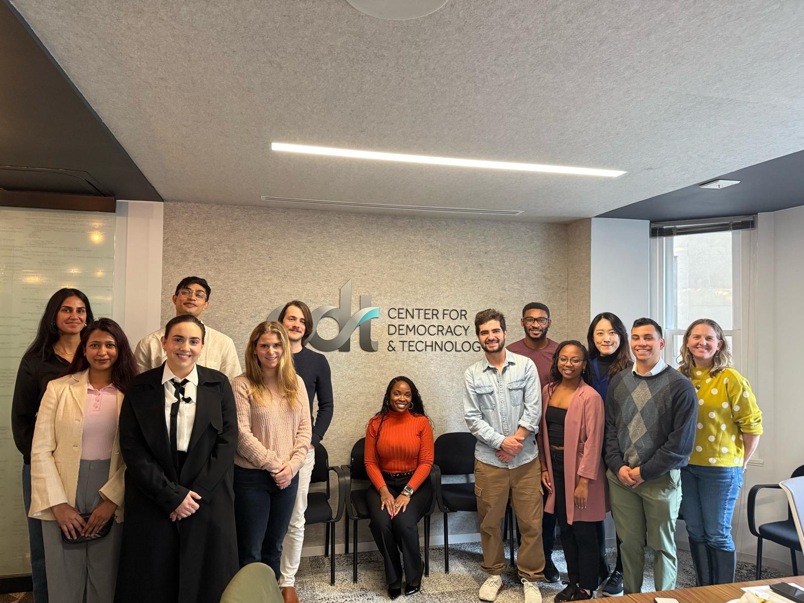
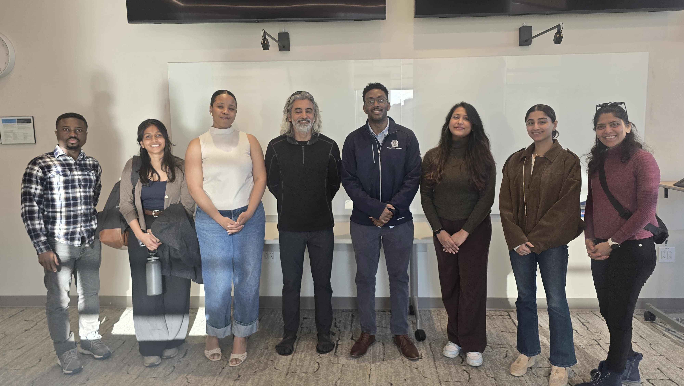
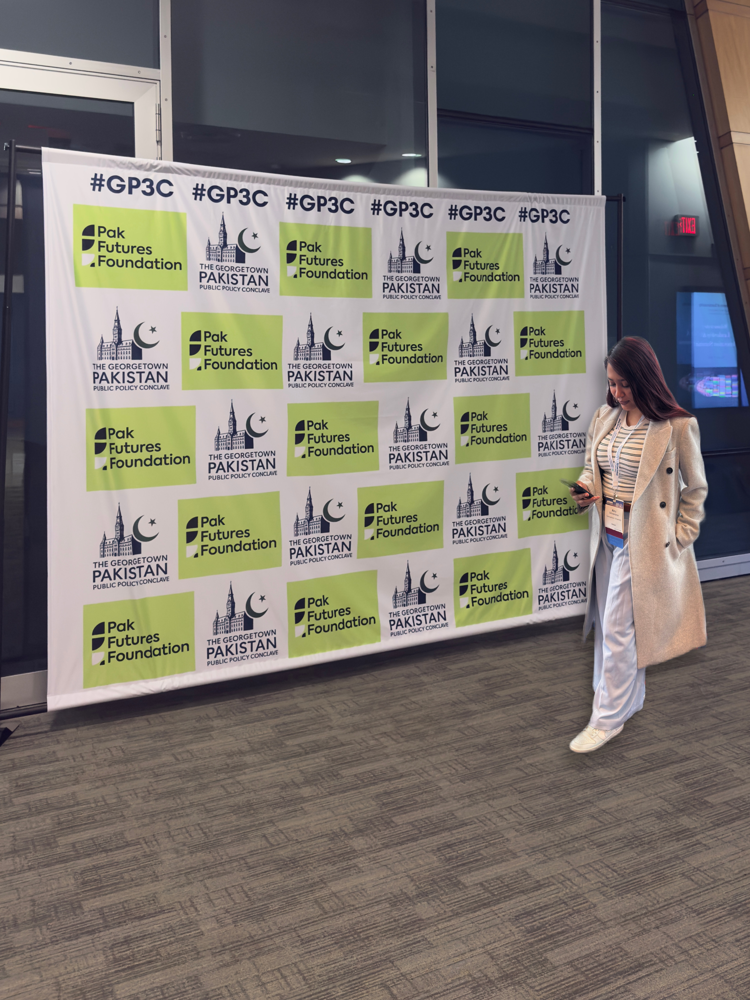
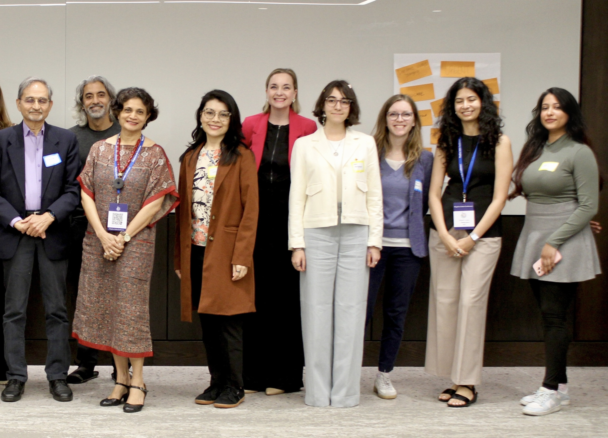

```{=html}
<!-- ═══════════════════════════════════════════════
     ACADEMIC — full-page photo mosaic background.
     Same idea as assets/travel/, but used as a tiled background
     layer behind the whole page instead of an inline gallery.
     Drop photos into assets/academic/ as college-1.jpg ... college-12.jpg.
═══════════════════════════════════════════════ -->
<div class="acad-photo-bg" aria-hidden="true">
  <div class="acad-photo-tile"></div>
  <div class="acad-photo-tile"></div>
  <div class="acad-photo-tile"></div>
  <div class="acad-photo-tile"></div>
  <div class="acad-photo-tile"></div>
  <div class="acad-photo-tile"></div>
  <div class="acad-photo-tile"></div>
  <div class="acad-photo-tile"></div>
  <div class="acad-photo-tile"></div>
  <div class="acad-photo-tile"></div>
  <div class="acad-photo-tile"></div>
  <div class="acad-photo-tile"></div>
  <div class="acad-photo-overlay"></div>
</div>

<div class="acad-page-content">

  <div class="page-hero acad-panel">
    <div class="content-section-impact" style="padding-top:0;padding-bottom:0;">
      <p class="eyebrow">Academic</p>
      <h1 style="font-size:2rem;margin-bottom:0.3rem;">Education &amp; Training</h1>
      <p class="acad-hero-desc" style="font-size:0.95rem;max-width:520px;line-height:1.6;">
        Quantitative methods, causal inference, and evidence-based policy — the methodological backbone behind the work.
      </p>
    </div>
  </div>

  <div class="content-section-impact acad-panel">

    <div class="acad-grid">
      <div class="acad-card sel">
        <div class="acad-icon">🎓</div>
        <div class="acad-deg">M.S. Public Policy (PPOL)</div>
        <div class="acad-inst">Georgetown University · McCourt School</div>
        <div class="acad-yr">2024 – 2026</div>
      </div>
      <div class="acad-card">
        <div class="acad-icon">💻</div>
        <div class="acad-deg">B.Tech. Information Technology</div>
        <div class="acad-inst">SRM University of Chennai</div>
        <div class="acad-yr">2015 – 2019</div>
      </div>
      <div class="acad-card">
        <div class="acad-icon">🏫</div>
        <div class="acad-deg">High School (PCM + CS)</div>
        <div class="acad-inst">Delhi Public School, Vasant Kunj</div>
        <div class="acad-yr">2013 – 2015</div>
      </div>
    </div>

    <!-- ═══════════════════════════════════════════════
         COURSEWORK
    ═══════════════════════════════════════════════ -->
    <div class="section-divider" style="margin-top:1.6rem;">Coursework</div>

    <div class="pills-row">
      <span class="pill pill-blue">Environmental Policy</span>
      <span class="pill pill-teal">Statistical Methods for Policy Analysis</span>
      <span class="pill pill-blue">Comparative Politics of Policy-Making</span>
      <span class="pill pill-teal">Microeconomics I and II: Market Failure &amp; Public Economics</span>
      <span class="pill pill-blue">Management &amp; Implementation in Developing Countries</span>
      <span class="pill pill-teal">Nonprofits, Philanthropy &amp; Policy</span>
      <span class="pill pill-sky">Advanced Regression / Program Evaluation Methods</span>
      <span class="pill pill-blue">Ethics, Values &amp; Public Policy</span>
      <span class="pill pill-sky">Corporate Social Responsibility &amp; Impact Investing</span>
      <span class="pill pill-blue">Global Governance on the Brink</span>
      <span class="pill pill-teal">Global Institutions: UN &amp; Beyond</span>
      <span class="pill pill-sky">Effective Advocacy Communications</span>
      <span class="pill pill-teal">Experimental Design &amp; Implementation</span>
    </div>

    <!-- ═══════════════════════════════════════════════
         THESIS & RESEARCH
    ═══════════════════════════════════════════════ -->
    <div class="section-divider">Thesis &amp; research</div>

    <div class="thesis-card">
      <div class="thesis-tag">M.P.P. Thesis · Georgetown McCourt School of Public Policy</div>
      <div class="thesis-title">The Slaughterhouse Effect: Industrial Livestock Production and Gender-Based Violence Across OECD States</div>
      <div class="thesis-desc">
        Examines the structural link between the Livestock Production Index and gender-based violence across 38 OECD countries.
        Combines pooled OLS with year fixed effects, synthetic control methods (Netherlands, treatment year 1995), and robustness
        checks using female homicide rates as a time-varying alternative outcome. Surfaces the <strong>Reporting Paradox</strong> —
        the finding that GBV data is largely time-invariant per country, pointing to systematic underreporting rather than a true
        null effect.
      </div>
      <div style="display:flex;flex-wrap:wrap;gap:0.4rem;margin:0.9rem 0 1rem;">
        <span class="pill pill-blue">Causal inference</span>
        <span class="pill pill-teal">Synthetic control</span>
        <span class="pill pill-sky">Stata</span>
        <span class="pill pill-blue">Gender &amp; development</span>
      </div>
      <div class="thesis-links">
        <a href="https://www.proquest.com/docview/3348780182?sourcetype=Dissertations%20&%20Theses" target="_blank" rel="noopener" class="card-link">Read the full thesis on ProQuest →</a>
      </div>
    </div>

    <div class="thesis-card" style="margin-top:1.2rem;">
      <div class="thesis-tag">B.Tech. Thesis · SRM University of Chennai</div>
      <div class="thesis-title">AI Model and App for Plant Disease Detection</div>
      <div class="thesis-desc">
        Developed a mobile application backed by a convolutional neural network (CNN) for real-time detection and classification
        of plant diseases from leaf images. The system achieved high accuracy across multiple crop species, with a field-deployable
        Android app interface designed for low-connectivity agricultural settings. Combined transfer learning with custom training
        data to improve generalization on limited samples.
      </div>
      <div style="display:flex;flex-wrap:wrap;gap:0.4rem;margin:0.9rem 0 1rem;">
        <span class="pill pill-blue">Deep learning · CNN</span>
        <span class="pill pill-teal">Mobile app</span>
        <span class="pill pill-sky">Agricultural tech</span>
        <span class="pill pill-blue">Transfer learning</span>
      </div>
      <div class="thesis-links">
        <a href="https://github.com/AnuritaS/cropDiseaseDetection" target="_blank" rel="noopener" class="card-link">Reproducible code on GitHub →</a>
      </div>
    </div>

    <!-- ═══════════════════════════════════════════════
         CERTIFICATIONS
    ═══════════════════════════════════════════════ -->
    <div class="section-divider">Certifications</div>
    <div class="cert-grid">
      <div class="cert-card">
        <div class="cert-icon">📜</div>
        <div class="cert-name">Financial Modeling</div>
      </div>
      <div class="cert-card">
        <div class="cert-icon">📱</div>
        <div class="cert-name">iOS Development — Udacity Nanodegree</div>
      </div>
      <div class="cert-card">
        <div class="cert-icon">💡</div>
        <div class="cert-name">Design Thinking</div>
      </div>
      <div class="cert-card">
        <div class="cert-icon">🤖</div>
        <div class="cert-name">AI Microcredential</div>
      </div>
      <div class="cert-card">
        <div class="cert-icon">🐍</div>
        <div class="cert-name">Python — Advanced</div>
      </div>
    </div>


  </div>

</div>
```
