```{=html}
<!-- ═══════════════════════════════════════════════
     OFF THE CLOCK — illustrated full-page background.
     All artwork below is original (sky, hills, clouds, fireflies,
     birds, and one small lantern-spirit character) — built as
     plain SVG/CSS, not sourced from any film or studio.
═══════════════════════════════════════════════ -->
<div class="offclock-scene">

  <div class="offclock-bg" aria-hidden="true">
    <svg viewBox="0 0 1000 700" preserveAspectRatio="xMidYMid slice" xmlns="http://www.w3.org/2000/svg">
      <defs>
        <linearGradient id="ocSky" x1="0" y1="0" x2="0" y2="1">
          <stop offset="0%" stop-color="#2E2A57"/>
          <stop offset="40%" stop-color="#5C4E84"/>
          <stop offset="70%" stop-color="#C97B6A"/>
          <stop offset="100%" stop-color="#F2B879"/>
        </linearGradient>
        <linearGradient id="ocHillFar" x1="0" y1="0" x2="0" y2="1">
          <stop offset="0%" stop-color="#3B5C66"/>
          <stop offset="100%" stop-color="#2C4A52"/>
        </linearGradient>
        <linearGradient id="ocHillMid" x1="0" y1="0" x2="0" y2="1">
          <stop offset="0%" stop-color="#2F4F3D"/>
          <stop offset="100%" stop-color="#22392C"/>
        </linearGradient>
        <linearGradient id="ocHillNear" x1="0" y1="0" x2="0" y2="1">
          <stop offset="0%" stop-color="#1F3A2A"/>
          <stop offset="100%" stop-color="#142719"/>
        </linearGradient>
        <radialGradient id="ocMoonGlow" cx="50%" cy="50%" r="50%">
          <stop offset="0%" stop-color="#FFF6D8" stop-opacity="0.9"/>
          <stop offset="100%" stop-color="#FFF6D8" stop-opacity="0"/>
        </radialGradient>
        <radialGradient id="ocLanternGlow" cx="50%" cy="50%" r="50%">
          <stop offset="0%" stop-color="#FFE6A8" stop-opacity="0.95"/>
          <stop offset="100%" stop-color="#FFE6A8" stop-opacity="0"/>
        </radialGradient>
      </defs>

      <rect width="1000" height="700" fill="url(#ocSky)"/>

      <!-- moon -->
      <circle cx="800" cy="120" r="90" fill="url(#ocMoonGlow)"/>
      <circle cx="800" cy="120" r="42" fill="#FFF6D8"/>

      <!-- birds -->
      <g class="oc-bird" style="transform:translate(180px,90px);">
        <path class="oc-bird-wing" d="M0,0 Q-14,-8 -24,0 Q-14,4 0,0" fill="#1B2A38"/>
        <path class="oc-bird-wing" d="M0,0 Q14,-8 24,0 Q14,4 0,0" fill="#1B2A38"/>
      </g>
      <g class="oc-bird" style="transform:translate(230px,70px) scale(0.7);">
        <path class="oc-bird-wing" d="M0,0 Q-14,-8 -24,0 Q-14,4 0,0" fill="#1B2A38"/>
        <path class="oc-bird-wing" d="M0,0 Q14,-8 24,0 Q14,4 0,0" fill="#1B2A38"/>
      </g>

      <!-- clouds -->
      <g class="oc-cloud" opacity="0.5" fill="#7C6B96">
        <ellipse cx="140" cy="180" rx="80" ry="26"/>
        <ellipse cx="200" cy="190" rx="55" ry="20"/>
      </g>
      <g class="oc-cloud" opacity="0.4" fill="#9A86AE" style="animation-duration:52s;">
        <ellipse cx="620" cy="150" rx="70" ry="22"/>
        <ellipse cx="670" cy="160" rx="46" ry="18"/>
      </g>

      <!-- hills -->
      <path d="M0,420 C150,380 300,440 480,400 C650,365 800,420 1000,390 L1000,700 L0,700 Z" fill="url(#ocHillFar)"/>
      <path d="M0,480 C180,440 360,500 540,460 C700,430 860,480 1000,450 L1000,700 L0,700 Z" fill="url(#ocHillMid)"/>
      <path d="M0,560 C200,520 380,580 560,540 C740,505 880,555 1000,530 L1000,700 L0,700 Z" fill="url(#ocHillNear)"/>

      <!-- lantern spirit — small original character, glowing wisp with a soft face -->
      <g class="oc-lantern" style="transform:translate(640px,460px);">
        <circle r="30" fill="url(#ocLanternGlow)"/>
        <circle r="9" fill="#FFE6A8" class="oc-lantern-glow"/>
        <circle cx="-9" cy="2" r="2.3" fill="#3E2A12"/>
        <circle cx="9" cy="2" r="2.3" fill="#3E2A12"/>
        <path d="M-5,9 Q0,12 5,9" stroke="#3E2A12" stroke-width="1.3" fill="none"/>
      </g>

      <!-- fireflies -->
      <g fill="#FFE9A0">
        <circle class="oc-firefly" cx="150" cy="640" r="3" style="animation-duration:6s;animation-delay:0s;"/>
        <circle class="oc-firefly" cx="300" cy="630" r="2.4" style="animation-duration:7.5s;animation-delay:1.5s;"/>
        <circle class="oc-firefly" cx="420" cy="650" r="3" style="animation-duration:5.5s;animation-delay:3s;"/>
        <circle class="oc-firefly" cx="560" cy="635" r="2.6" style="animation-duration:8s;animation-delay:0.8s;"/>
        <circle class="oc-firefly" cx="700" cy="645" r="3" style="animation-duration:6.5s;animation-delay:2.2s;"/>
        <circle class="oc-firefly" cx="850" cy="630" r="2.4" style="animation-duration:7s;animation-delay:4s;"/>
        <circle class="oc-firefly" cx="920" cy="650" r="3" style="animation-duration:5.8s;animation-delay:1s;"/>
      </g>
    </svg>
  </div>

  <div class="offclock-content">

    <div class="offclock-eyebrow">🌿 Off the clock</div>
    <div class="offclock-title">Strategy, systems thinking, and showing up for people</div>
    <p class="offclock-lede">
      Turns out the games I love, the volunteering I do, and the policy work I do aren't so different.
    </p>

    <!-- ═══════════════════════════════════════════════
         VOLUNTEER WORK
    ═══════════════════════════════════════════════ -->
    <div class="offclock-panel">
      <h3>Volunteer work</h3>
      <div class="quote-block" style="margin-bottom:1.2rem;max-width:520px;">
        "What you do makes a difference, and you have to decide what kind of difference you want to make." — Jane Goodall
      </div>
      <div class="offclock-grid">
        <div class="offclock-card has-photo">
          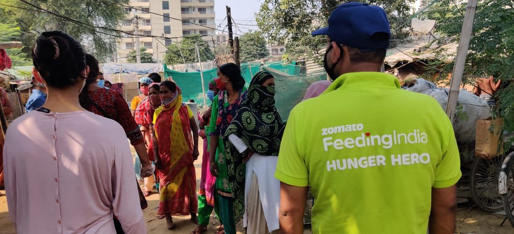
          <div class="oc-photo-body">
            <div class="oc-title">Zomato Feeding India</div>
            <div class="oc-meta">Hunger Hero · Food donation drives</div>
            <div class="oc-desc">On-ground food distribution runs in Delhi communities — handing out meals door to door as part of Feeding India's Hunger Hero program.</div>
          </div>
        </div>
        <div class="offclock-card has-photo">
          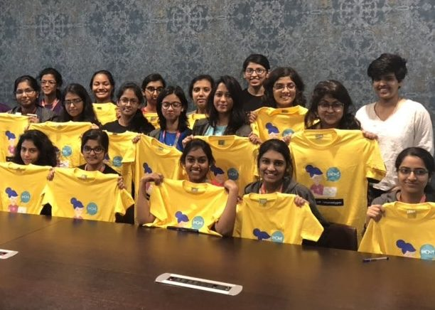
          <div class="oc-photo-body">
            <div class="oc-title">Coding camp</div>
            <div class="oc-meta">Volunteer instructor</div>
            <div class="oc-desc">Teaching at a coding camp for girls — one cohort of many people who showed up wanting to learn, and stayed for the community.</div>
          </div>
        </div>
        <div class="offclock-card has-photo">
          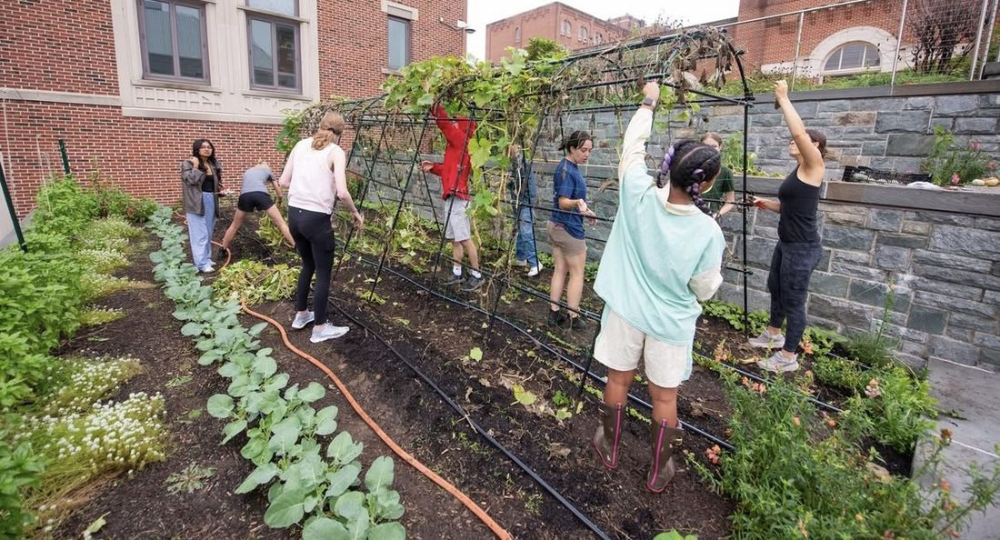
          <div class="oc-photo-body">
            <div class="oc-title">Hoya Harvest</div>
            <div class="oc-meta">Garden duty</div>
            <div class="oc-desc">Building trellises and tending raised beds on campus — hands in the dirt between policy classes.</div>
          </div>
        </div>
        <div class="offclock-card has-photo">
          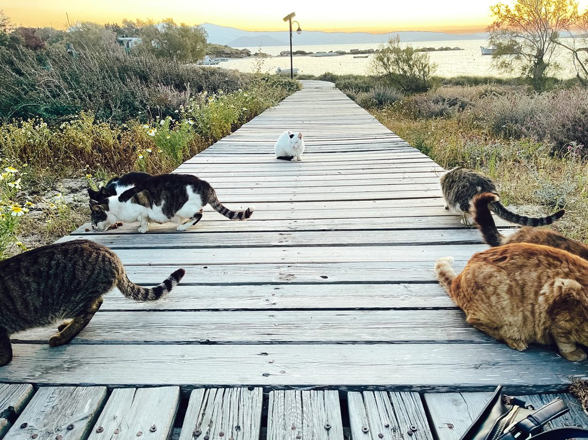
          <div class="oc-photo-body">
            <div class="oc-title">Animal shelter &amp; community cats</div>
            <div class="oc-meta">Feeding, fostering, advocacy</div>
            <div class="oc-desc">Same instinct as the Feeding India work, smaller scale — making sure the animals nobody's officially responsible for still get fed and looked after.</div>
          </div>
        </div>
      </div>
    </div>

    <!-- ═══════════════════════════════════════════════
         GAMING
    ═══════════════════════════════════════════════ -->
    <div class="offclock-panel gaming-panel">
      <h3>Gaming &amp; all-time favourites</h3>
      <div class="offclock-grid">
        <div class="offclock-card has-photo">
          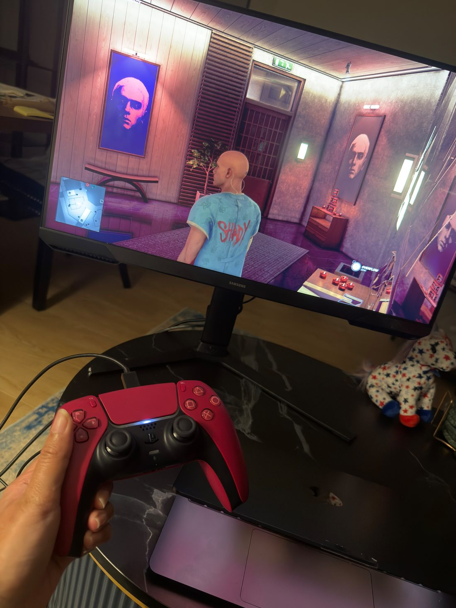
          <div class="oc-photo-body">
            <div class="oc-title">GTA Online</div>
            <div class="oc-meta">The Contract · Dr. Dre &amp; Eminem update</div>
            <div class="oc-desc">Repping the "Shady" tee in an Eminem-poster-lined safehouse — red DualSense in hand.</div>
          </div>
        </div>
        <div class="offclock-card has-photo">
          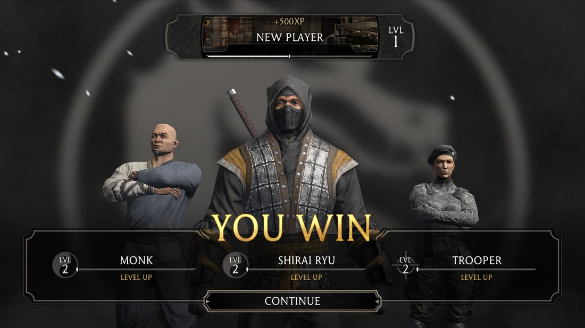
          <div class="oc-photo-body">
            <div class="oc-title">Mortal Kombat</div>
            <div class="oc-meta">"You Win" never gets old</div>
            <div class="oc-desc">Monk, Shirai Ryu, and Trooper all leveling up after a clean win.</div>
          </div>
        </div>
        <div class="offclock-card has-photo">
          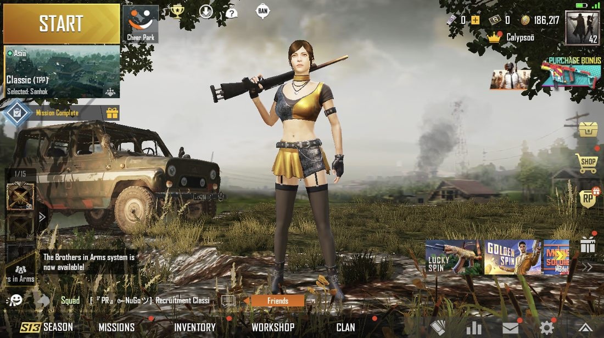
          <div class="oc-photo-body">
            <div class="oc-title">PUBG Mobile</div>
            <div class="oc-meta">Sanhok, classic TPP</div>
            <div class="oc-desc">Level 42 and still dropping into Sanhok with the squad.</div>
          </div>
        </div>
        <div class="offclock-card has-photo">
          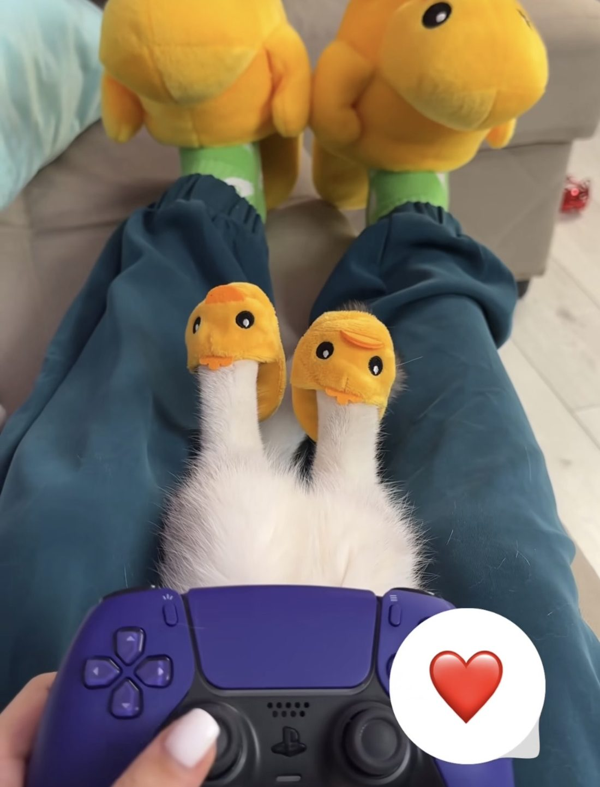
          <div class="oc-photo-body">
            <div class="oc-title">My real co-op partner</div>
            <div class="oc-meta">Reviews every controller input</div>
            <div class="oc-desc">No game night is complete without supervision — duck slippers included.</div>
          </div>
        </div>
      </div>
    </div>

    <!-- ═══════════════════════════════════════════════
         OTHER ACTIVITIES
    ═══════════════════════════════════════════════ -->
    <div class="offclock-panel">
      <h3>Other activities</h3>
      <div class="offclock-grid">
        <div class="offclock-card has-photo">
          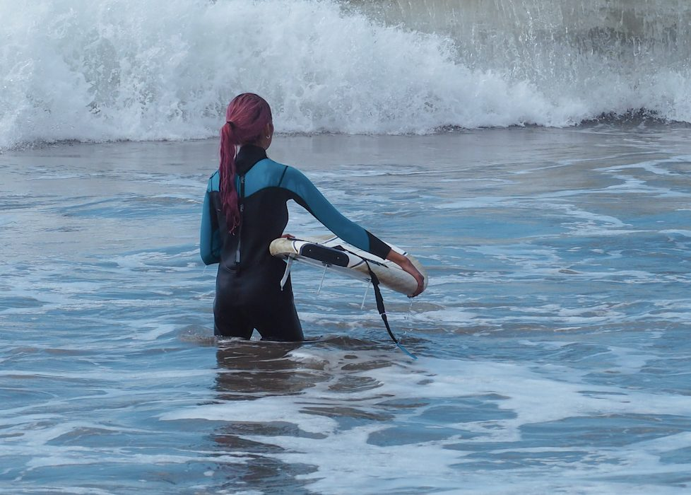
          <div class="oc-photo-body">
            <div class="oc-title">Swimming &amp; surfing</div>
            <div class="oc-meta">Chasing waves, not always catching them</div>
            <div class="oc-desc">Wetsuit on, watching the swell roll in before paddling out.</div>
          </div>
        </div>
        <div class="offclock-card has-photo">
          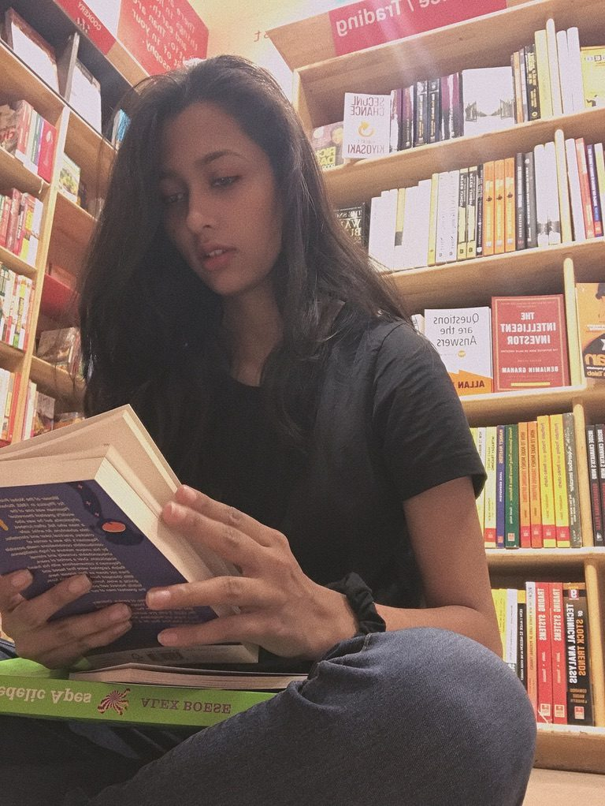
          <div class="oc-photo-body">
            <div class="oc-title">Book reading</div>
            <div class="oc-meta">Bookstore browsing is half the hobby</div>
            <div class="oc-desc">Deep in a new read, stacked on top of whatever I bought five minutes earlier.</div>
          </div>
        </div>
        <div class="offclock-card has-photo">
          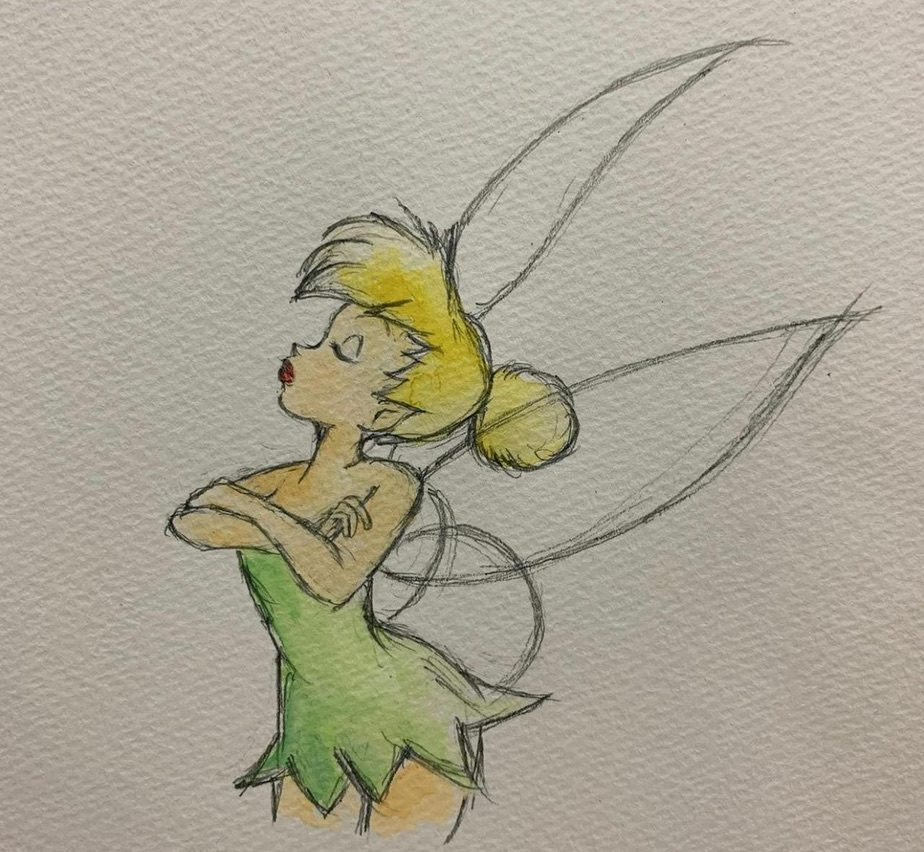
          <div class="oc-photo-body">
            <div class="oc-title">Arts &amp; crafts</div>
            <div class="oc-meta">Watercolor &amp; pencil</div>
            <div class="oc-desc">A quiet evening hobby — sketching first, then watercolor to fill it in.</div>
          </div>
        </div>
        <div class="offclock-card has-photo">
          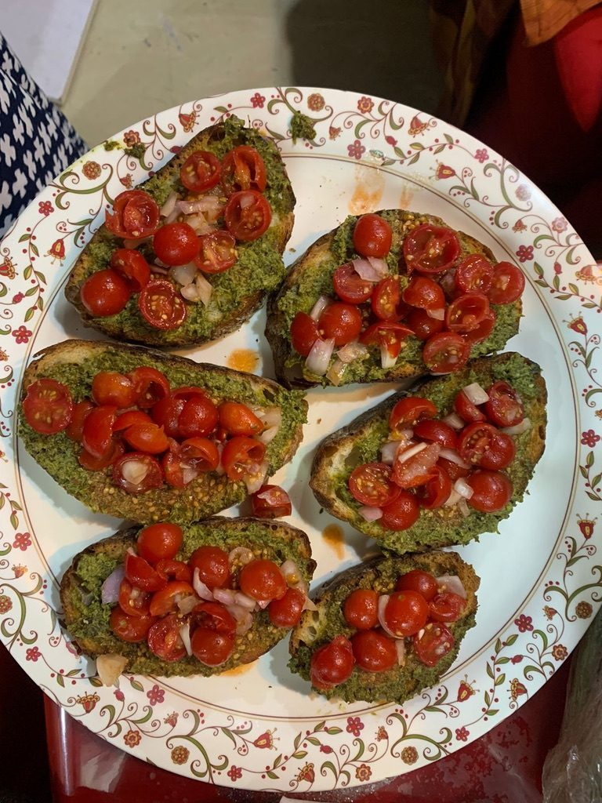
          <div class="oc-photo-body">
            <div class="oc-title">Hosting</div>
            <div class="oc-meta">Usually starts with bruschetta</div>
            <div class="oc-desc">Home-made bruschetta — cherry tomatoes, pesto, shallots — for whoever's coming over.</div>
          </div>
        </div>
      </div>
    </div>

  </div>
</div>
```

