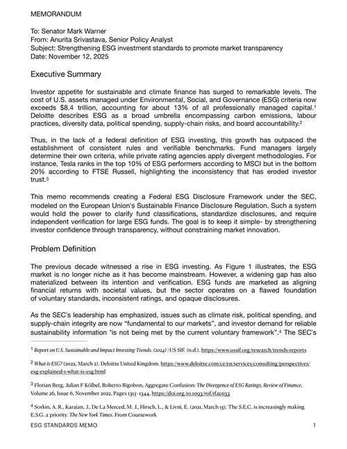
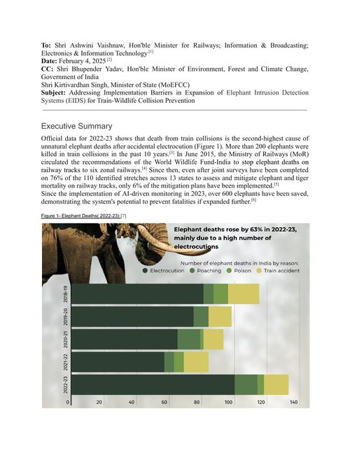
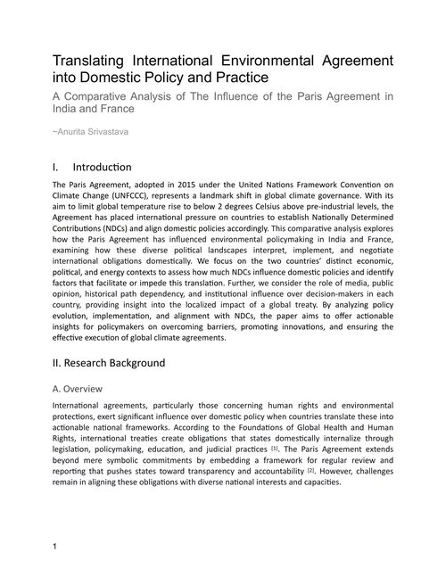
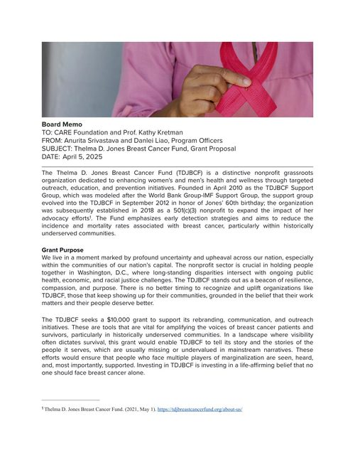
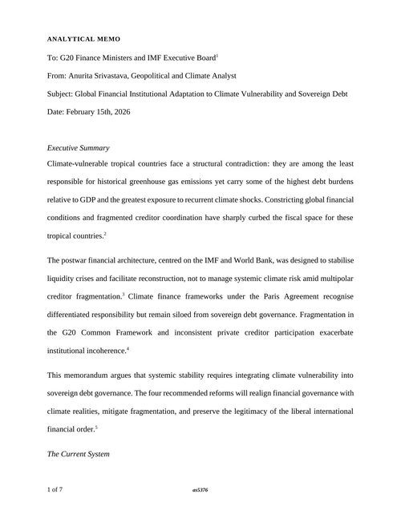
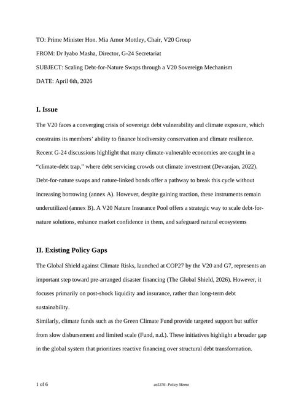
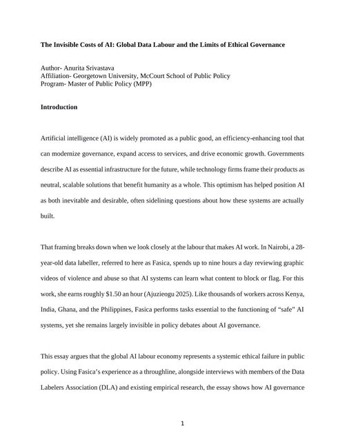

```{=html}
<div class="ws-grid">

  <div class="ws-card">
    <a href="../assets/writing-samples/esg-memo.pdf" target="_blank" rel="noopener" class="ws-thumb-link">
      
    </a>
    <div class="ws-body">
      <div class="ws-tag">To Senator Mark Warner</div>
      <div class="ws-title">Strengthening ESG Investment Standards to Promote Market Transparency</div>
      <div class="ws-desc">
        Makes the case for a Federal ESG Disclosure Framework under the SEC, modeled on the EU's Sustainable Finance Disclosure Regulation — standardized disclosure templates, third-party verification above $500M AUM, and a ban on unverified "green" branding. Walks through four policy options with feasibility, political support, and fiscal cost for each, plus a phased near/medium/long-term implementation timeline.
      </div>
      <a href="../assets/writing-samples/esg-memo.pdf" target="_blank" rel="noopener" class="card-link">Download PDF ↗</a>
    </div>
  </div>

  <div class="ws-card">
    <a href="../assets/writing-samples/eids-memo.pdf" target="_blank" rel="noopener" class="ws-thumb-link">
      
    </a>
    <div class="ws-body">
      <div class="ws-tag">To Shri Ashwini Vaishnaw, Minister for Railways (India)</div>
      <div class="ws-title">Addressing Implementation Barriers in Expansion of Elephant Intrusion Detection Systems (EIDS)</div>
      <div class="ws-desc">
        Examines why only 6% of identified elephant-mortality mitigation plans on Indian railway tracks have been implemented, despite an AI monitoring system credited with saving 600+ elephants since 2023. Diagnoses the barriers — slow state-level environmental clearances, no single accountable agency between the Ministry of Railways and MoEFCC, and chronic underfunding relative to railway modernization — and proposes PPP/CSR co-financing to scale the system.
      </div>
      <a href="../assets/writing-samples/eids-memo.pdf" target="_blank" rel="noopener" class="card-link">Download PDF ↗</a>
    </div>
  </div>

  <div class="ws-card">
    <a href="../assets/writing-samples/environmental-policy-rp.pdf" target="_blank" rel="noopener" class="ws-thumb-link">
      
    </a>
    <div class="ws-body">
      <div class="ws-tag">Comparative policy research</div>
      <div class="ws-title">Translating International Environmental Agreements into Domestic Policy: India and France Under the Paris Agreement</div>
      <div class="ws-desc">
        Compares how India and France translate Paris Agreement NDCs into domestic policy, given their contrasting energy profiles — India's ~70% coal-dependent grid against ambitious renewable targets, France's nuclear-heavy, lower-emission base. Traces the legislative path of India's 500 GW renewable target and France's coal phase-out, and weighs path dependency, public opinion, and political will as drivers of compliance speed in each country.
      </div>
      <a href="../assets/writing-samples/environmental-policy-rp.pdf" target="_blank" rel="noopener" class="card-link">Download PDF ↗</a>
    </div>
  </div>
  <div class="ws-card">
    <a href="../assets/writing-samples/tdjbcf-memo.pdf" target="_blank" rel="noopener" class="ws-thumb-link">
      
    </a>
    <div class="ws-body">
      <div class="ws-tag">To CARE Foundation &amp; Prof. Kathy Kretman · co-written with Danlei Liao</div>
      <div class="ws-title">Thelma D. Jones Breast Cancer Fund — Grant Proposal Board Memo</div>
      <div class="ws-desc">
        Case for a $10,000 grant funding TDJBCF's rebranding, communications, and outreach — reaching breast cancer survivors in Washington D.C.'s Ward 6, where Black women face a mortality rate twice that of white women. Lays out a budget, an impact-measurement framework across four metric categories, and the organization's reach (~72,000 people across DC, Northern Virginia, and Maryland).
      </div>
      <a href="../assets/writing-samples/tdjbcf-memo.pdf" target="_blank" rel="noopener" class="card-link">Download PDF ↗</a>
    </div>
  </div>
  <div class="ws-card">
    <a href="../assets/writing-samples/global-governance-memo.pdf" target="_blank" rel="noopener" class="ws-thumb-link">
      
    </a>
    <div class="ws-body">
      <div class="ws-tag">To G20 Finance Ministers &amp; the IMF Executive Board</div>
      <div class="ws-title">Global Financial Institutional Adaptation to Climate Vulnerability and Sovereign Debt</div>
      <div class="ws-desc">
        Argues that the Bretton Woods debt architecture was built for episodic liquidity crises, not the cumulative, structural climate shocks now facing low-emission, high-vulnerability states. Proposes four reforms — climate-resilient debt clauses, scaled debt-for-climate swaps, a reformed G20 Common Framework, and a new Climate Vulnerability Adjustment Mechanism for debt sustainability analysis.
      </div>
      <a href="../assets/writing-samples/global-governance-memo.pdf" target="_blank" rel="noopener" class="card-link">Download PDF ↗</a>
    </div>
  </div>

  <div class="ws-card">
    <a href="../assets/writing-samples/v20-nature-insurance-memo.pdf" target="_blank" rel="noopener" class="ws-thumb-link">
      
    </a>
    <div class="ws-body">
      <div class="ws-tag">Persona writing exercise — voiced as G-24 Secretariat Director, to the V20 Chair</div>
      <div class="ws-title">Scaling Debt-for-Nature Swaps Through a V20 Sovereign Mechanism</div>
      <div class="ws-desc">
        A coursework exercise written in the voice of a real institutional role, proposing a sovereign-backed V20 Nature Insurance Pool to underwrite biodiversity-linked debt and scale debt-for-nature swaps beyond one-off bilateral deals like Belize's and Seychelles'. Includes a full annex set: comparative case studies, a cost-benefit analysis, and a risk-assessment matrix.
      </div>
      <a href="../assets/writing-samples/v20-nature-insurance-memo.pdf" target="_blank" rel="noopener" class="card-link">Download PDF ↗</a>
    </div>
  </div>

  <div class="ws-card">
    <a href="../assets/writing-samples/ai-labour-essay.pdf" target="_blank" rel="noopener" class="ws-thumb-link">
      
    </a>
    <div class="ws-body">
      <div class="ws-tag">Academic essay · Georgetown McCourt School</div>
      <div class="ws-title">The Invisible Costs of AI: Global Data Labour and the Limits of Ethical Governance</div>
      <div class="ws-desc">
        Argues that AI governance frameworks externalize psychological and economic harm onto Global South data labelers — workers like Fasica in Nairobi, paid roughly $1.50/hour to review graphic content — while concentrating profit and decision-making in the Global North. Draws on distributive and cosmopolitan justice (Rawls, Pogge) and social contract theory to argue current "consent" framing doesn't hold, and proposes treating content moderation as high-risk labour with mandatory protections, data-labour royalties, and Global South representation in AI governance bodies.
      </div>
      <a href="../assets/writing-samples/ai-labour-essay.pdf" target="_blank" rel="noopener" class="card-link">Download PDF ↗</a>
    </div>
  </div>

</div>
```
