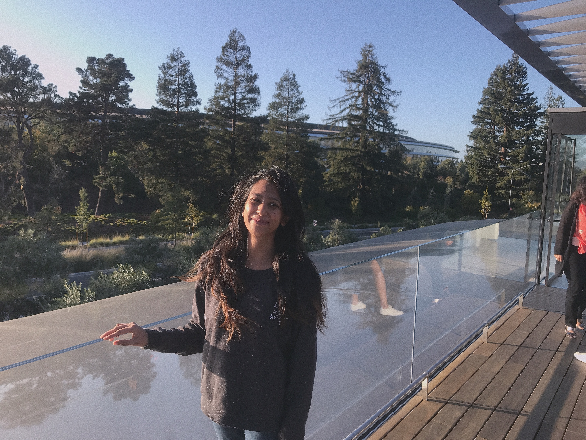
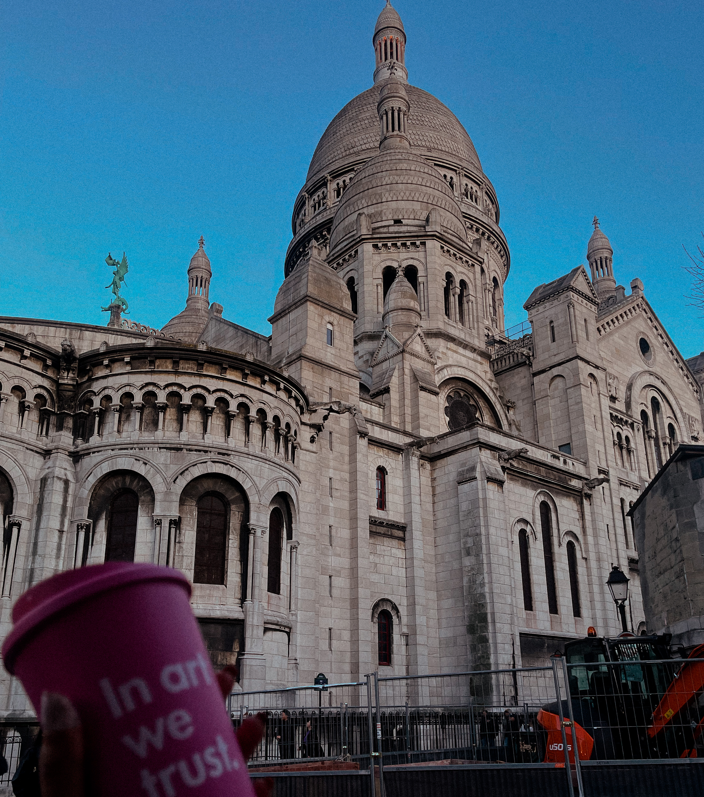
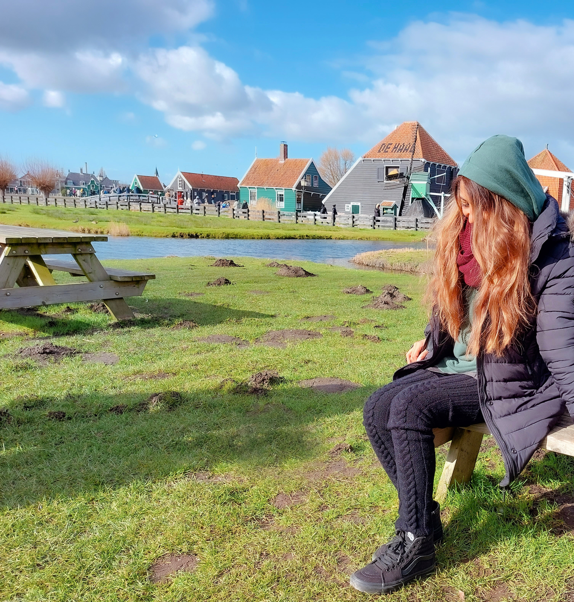
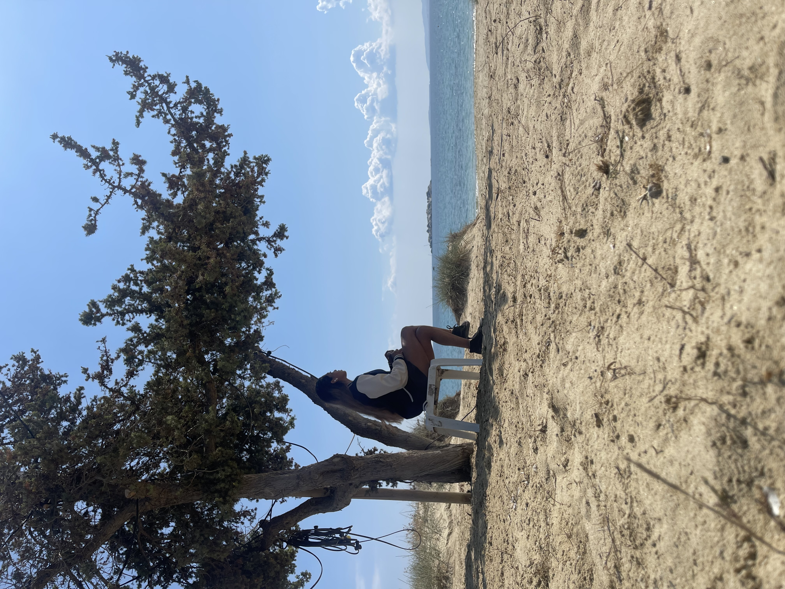

```{=html}
<div class="page-hero">
  <div class="content-section-impact" style="padding-top:0;padding-bottom:0;">
    <p class="eyebrow">Travel</p>
    <h1 style="font-size:2rem;margin-bottom:0.3rem;">Digital Nomad</h1>
    <p style="color:#4A6A88;font-size:0.95rem;max-width:520px;line-height:1.6;">
      20+ countries and counting — curiosity is my compass.
    </p>
  </div>
</div>

<div class="content-section-impact">

  <div class="travel-hero">
    <div>
      <p style="font-size:0.95rem;color:#2C4A66;line-height:1.85;">
        My travels have taught me to never judge a book by its cover, to take risks, and to stay curious. From the policy hubs of Washington D.C. to community health clinics in East Africa and the streets of Berlin, every place has sharpened how I think about evidence, equity, and change.
      </p>
    </div>

    <div class="globe-card">
      <div class="globe-icon">🌏</div>
      <div class="globe-note">20+ countries visited</div>
    </div>
  </div>

  <div class="section-divider">Snapshots</div>
  <div class="travel-gallery">
    <div class="travel-photo">
      
    </div>
    <div class="travel-photo">
      
    </div>
    <div class="travel-photo">
      
    </div>
    <div class="travel-photo">
      
    </div>
    <div class="travel-photo">
      
    </div>
    <div class="travel-photo">
      
    </div>
    <div class="travel-photo">
      
    </div>
    <div class="travel-photo">
      
    </div>
    <div class="travel-photo">
      
    </div>
    <div class="travel-photo">
      
    </div>
    <div class="travel-photo">
      
    </div>
    <div class="travel-photo">
      
    </div>
  </div>

</div>
```
